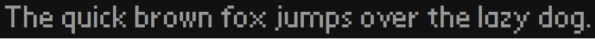
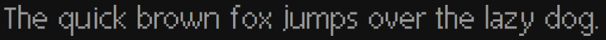

# PalmOS Alpha-style Fonts

The fonts file in this archive were created using [Fontstruct: The Free, Online Font-building Tool](https://fontstruct.com)

## Font Examples

### Alpha

### Alpha Bold

### Alpha Large

### Alpha Large Bold

## Original Authorship

This font was originally authored by “Goatmeal”.

## Fontstruct Credits

Try Fontstruct at https://fontstruct.com  
It’s easy and it’s fun!

Fontstruct is owned by Rob Meek
Copyright ©2009-2023
